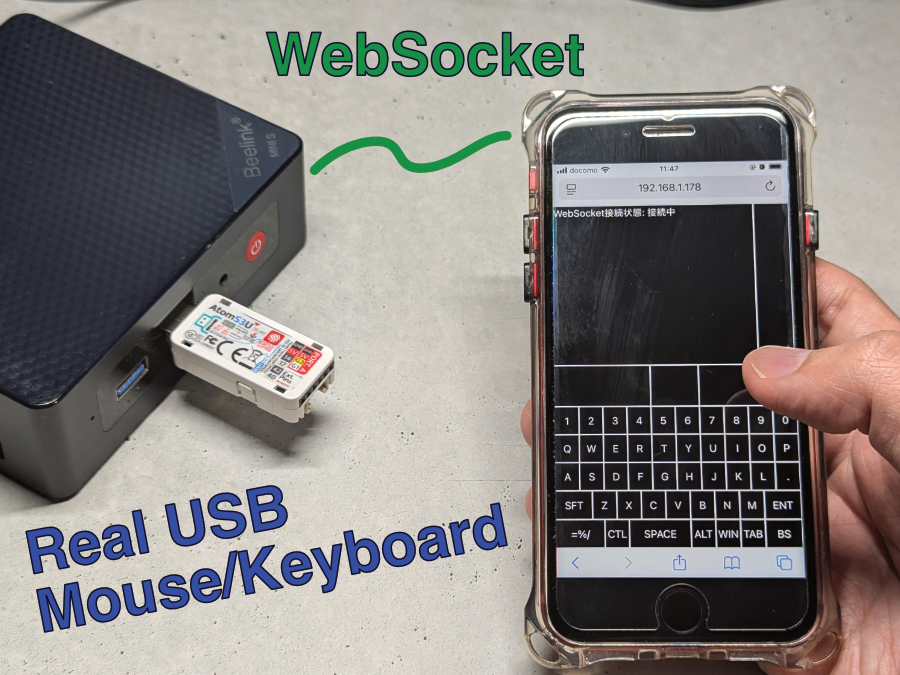
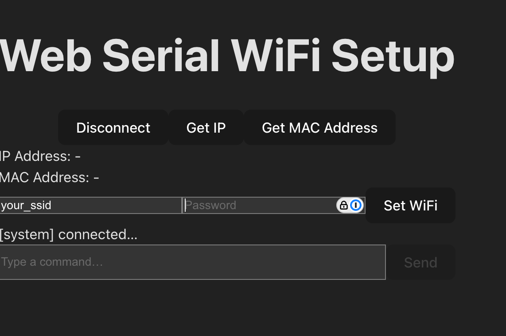

# Turn Your Phone into a PC Keyboard & Mouse with AtomS3U

[🇯🇵 日本語版](./README_ja.md)

An IoT device with AtomS3U turns your smartphone into a real USB keyboard and trackpad for any PC.



## Overview

- Use your smartphone as a USB keyboard and trackpad.
- Unlike typical ESP32 Bluetooth devices, it operates as a USB device, requiring no special setup on the PC.
- Easily input symbols by switching between multiple keyboard layouts.
- Wi-Fi can be configured via USB, and it includes a feature to notify the IP address using Morse code.

## How it Works


The AtomS3U connects to Wi-Fi and functions as an HTTP server.
When you access this HTTP server from your smartphone's web browser, a page with a trackpad and keyboard for operation is displayed.
This page communicates with the AtomS3U in real-time via WebSocket.

When you tap a keyboard button or operate the trackpad area, the information is sent to the AtomS3U via WebSocket.
The AtomS3U is recognized by the PC as a USB HID device and emulates key input and mouse operations based on the received information.

## Features

### Keyboard and Trackpad


Multiple keyboard layouts are available.
Symbols that would require using the `Shift` key on a physical keyboard can be easily entered with a single tap.


You can see it in action in this video.

### Wi-Fi Setup

If the LED is lit red, it is not connected to Wi-Fi.
You can configure the Wi-Fi by connecting it to your PC via USB and using a web browser.
Access the following page to set up the SSID and password.

 🌐 https://esp32-serial-wifi-setup.74th.tech



Once setup is complete, the LED will light up blue.

### IP Address Notification via Morse Code

When the LED is blue, pressing Button A will notify you of the last octet of the IP address (e.g., the `178` in `192.168.1.178`) via Morse code.

| Digit | Signal  |
| ---- | ----- |
| 0    | `-----` |
| 1    | `·----` |
| 2    | `··---` |
| 3    | `···--` |
| 4    | `····-` |
| 5    | `·····` |
| 6    | `-····` |
| 7    | `--···` |
| 8    | `---··` |
| 9    | `----·` |

For example, if the IP address is `192.168.1.178`, the signal will be as follows:

```
1     7     8
·---- --··· ---··
```

This feature uses [esp32-morse-code-ipaddress-indicator](https://github.com/74th/esp32-morse-code-ipaddress-indicator).

## Technology Stack

### WebSocket Communication

For WebSocket communication between the ESP32-S3 and the browser, the [Links2004/WebSockets](https://github.com/Links2004/arduinoWebSockets) library is used.

### Web Frontend

The web interface displayed in the browser was developed using React and Vite.
The frontend files built with Vite are compressed with gz and embedded in the ESP32's firmware.

When using PlatformIO, you can embed the files into the firmware by adding the following to `platformio.ini`.

```ini
board_build.embed_files =
  data/index.html.gz
  data/assets/index.js.gz
  data/assets/style.css.gz
```

The embedded data can be accessed from the source code as follows:

```cpp
// Corresponds to data/index.html.gz
extern const uint8_t _binary_data_index_html_gz_start[] asm("_binary_data_index_html_gz_start");
extern const uint8_t _binary_data_index_html_gz_end[] asm("_binary_data_index_html_gz_end");
```

### Operation Protocol

The WebSocket communication protocol for sending keyboard and mouse operations is based on the specifications of the CH9329, a USB-to-UART converter IC.
This is a reuse of the protocol used in a previous project made with the CH9329 and ESP32-C3.

### Wi-Fi Setup via Web Browser

To enable Wi-Fi setup via a web browser, it uses a custom module called [ESP32 Serial WiFi Setup](https://github.com/74th/esp32-serial-wifi-setup).

https://github.com/74th/esp32-serial-wifi-setup

This module connects to the ESP32-S3's serial port using the WebSerial API and sets the Wi-Fi SSID and password using the JSON-RPC 2.0 protocol.
This allows for easy Wi-Fi configuration with just a USB connection, without needing to rebuild the firmware.

### IP Address Morse Code Notification

The feature to notify the IP address via Morse code uses a custom module called [ESP32 Morse Code IP Address Indicator](https://github.com/74th/esp32-morse-code-ipaddress-indicator).

https://github.com/74th/esp32-morse-code-ipaddress-indicator

This is useful for M5Stack products that do not have a display like an OLED, as it allows the user to know the IP address.
However, it requires the user to be able to interpret Morse code.
