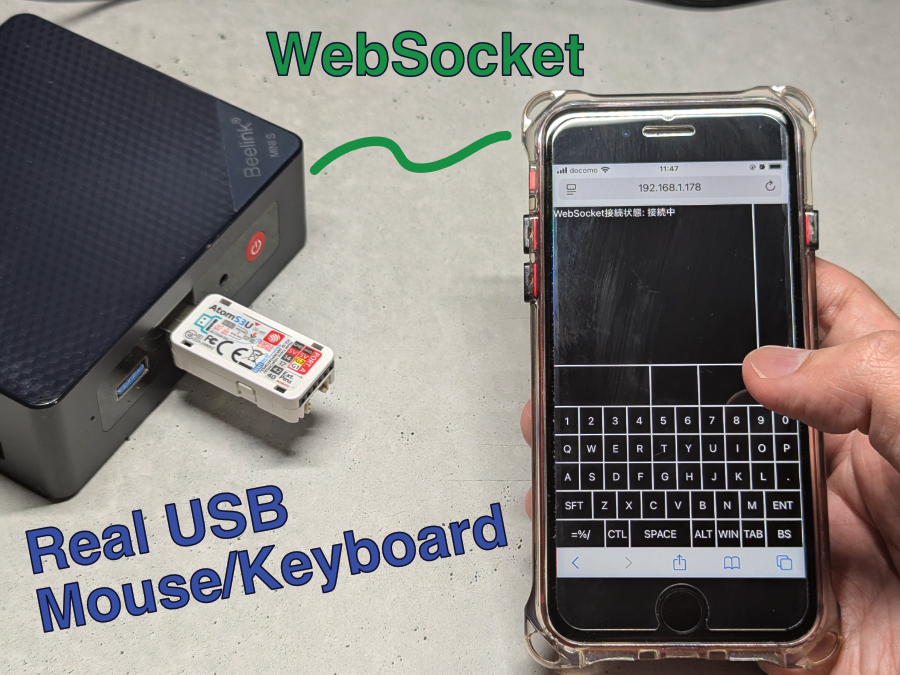
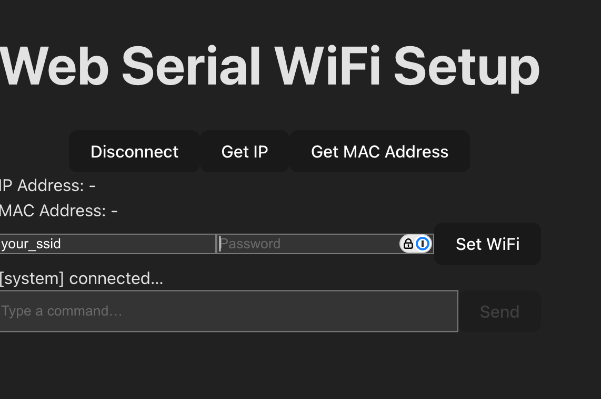

# スマートフォンをPCのUSBキーボード・マウスとして利用できるAtomS3U



## 概要

- スマートフォンをUSBキーボード・トラックパッドとして使用できます。
- ESP32で一般的なBluetooth接続のデバイスとは異なり、USBデバイスとして動作するため、PC側での特別なセットアップは不要です。
- 複数のキーボードレイアウトを切り替えることで、記号なども簡単に入力できます。
- WiFiの設定はUSB経由で行え、IPアドレスをモールス信号で通知する機能も備えています。

## 仕組み


AtomS3UはWiFiに接続し、HTTPサーバーとして機能します。
スマートフォンのWebブラウザからこのHTTPサーバーにアクセスすると、操作用のトラックパッドとキーボードのページが表示されます。
このページはWebSocketを介してAtomS3Uとリアルタイムに通信します。

キーボードのボタンをタップしたり、トラックパッド領域を操作したりすると、その情報がWebSocket経由でAtomS3Uに送信されます。
AtomS3UはPCにUSB HIDデバイスとして認識されており、受け取った情報に基づいてキー入力やマウス操作をエミュレートします。

## 機能

### キーボード・トラックパッド


キーボードには複数のレイアウトが用意されています。
物理キーボードでは`Shift`キーと併用する必要があるような記号も、1タップで簡単に入力できます。


実際の操作の様子を動画でご覧いただけます。

### WiFiセットアップ

LEDが赤色に点灯している場合、WiFiに接続できていません。
WiFiの設定は、PCにUSBで接続し、Webブラウザから行うことができます。
以下のページにアクセスし、SSIDとパスワードを設定してください。

🌐 https://esp32-serial-wifi-setup.74th.tech



セットアップが完了すると、LEDが青色に点灯します。

### IPアドレスのモールス信号通知

LEDが青色に点灯している状態でボタンAを押すと、IPアドレスの最後の1オクテット（例: `192.168.1.178` の `178` の部分）がモールス信号で通知されます。

| 数字 | 信号  |
| ---- | ----- |
| 0    | `-----` |
| 1    | `·----` |
| 2    | `··---` |
| 3    | `···--` |
| 4    | `····-` |
| 5    | `·····` |
| 6    | `-····` |
| 7    | `--···` |
| 8    | `---··` |
| 9    | `----·` |

例えば、IPアドレスが `192.168.1.178` の場合、信号は以下のようになります。

```
1     7     8
·---- --··· ---··
```

この機能には [esp32-morse-code-ipaddress-indicator](https://github.com/74th/esp32-morse-code-ipaddress-indicator) を使用しています。

## 技術要素

### WebSocket通信

ESP32-S3とブラウザ間のWebSocket通信には、[Links2004/WebSockets](https://github.com/Links2004/arduinoWebSockets) ライブラリを使用しています。

### Webフロントエンド

ブラウザで表示されるWeb画面は、ReactとViteを使用して開発しました。
Viteでビルドしたフロントエンドのファイル群は、gz圧縮してESP32のファームウェアに組み込んでいます。

PlatformIOを使用する場合、`platformio.ini` に以下を追記することで、ファイルをファームウェアに埋め込むことができます。

```ini
board_build.embed_files =
  data/index.html.gz
  data/assets/index.js.gz
  data/assets/style.css.gz
```

ソースコードからは、以下のようにして埋め込まれたデータにアクセスします。

```cpp
// data/index.html.gz に対応
extern const uint8_t _binary_data_index_html_gz_start[] asm("_binary_data_index_html_gz_start");
extern const uint8_t _binary_data_index_html_gz_end[] asm("_binary_data_index_html_gz_end");
```

### 操作プロトコル

キーボード入力やマウス操作を送信するためのWebSocketの通信プロトコルは、CH9329というUSB-UART変換ICの仕様を参考にしました。
これは、以前CH9329とESP32-C3で同様のプロジェクトを製作した際に用いたプロトコルを流用したものです。

### Webブラウザ経由のWiFiセットアップ

Webブラウザ上でWiFiのセットアップを可能にするために、[ESP32 Serial WiFi Setup](https://github.com/74th/esp32-serial-wifi-setup) という自作モジュールを利用しています。

https://github.com/74th/esp32-serial-wifi-setup

このモジュールはWebSerial APIを用いてESP32-S3のシリアルポートに接続し、JSON-RPC 2.0プロトコルでWiFiのSSIDやパスワードを設定します。
これにより、ファームウェアを再ビルドすることなく、USB接続だけで簡単にWiFi設定ができます。

### IPアドレスのモールス信号通知

IPアドレスをモールス信号で通知する機能には、[ESP32 Morse Code IP Address Indicator](https://github.com/74th/esp32-morse-code-ipaddress-indicator) という自作モジュールを利用しています。

https://github.com/74th/esp32-morse-code-ipaddress-indicator

OLEDなどのディスプレイがないM5Stack製品でも、この機能を使えばIPアドレスを確認できるため便利です。
ただし、利用者がモールス信号を解読できる必要があります。

## AtomS3Uへの書き込み方法

[release page](https://github.com/74th/m5atoms3u-wifi-usb-keyboard) からファームウェアをダウンロードし、以下のツールを用いて書き込んでください。

### espflash

[espflash](https://github.com/esp-rs/espflash)

```
espflash write-bin 0 ./m5atoms3u-wifi-usb-keyboard.bin
```

### esptool

[esptool](https://github.com/espressif/esptool)

```
esptool --chip esp32s3 write-flash 0x0 ./m5atoms3u-wifi-usb-keyboard.bin
```

### M5BUrner

[M5Burner](https://docs.m5stack.com/en/uiflow/m5burner/intro)

search "WiFi USB Keyboard for AtomS3U".
